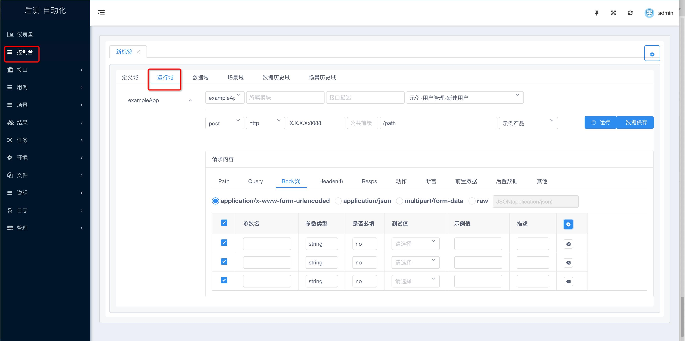
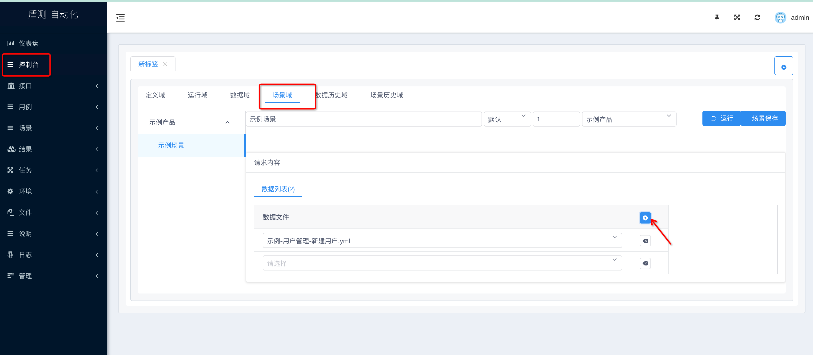
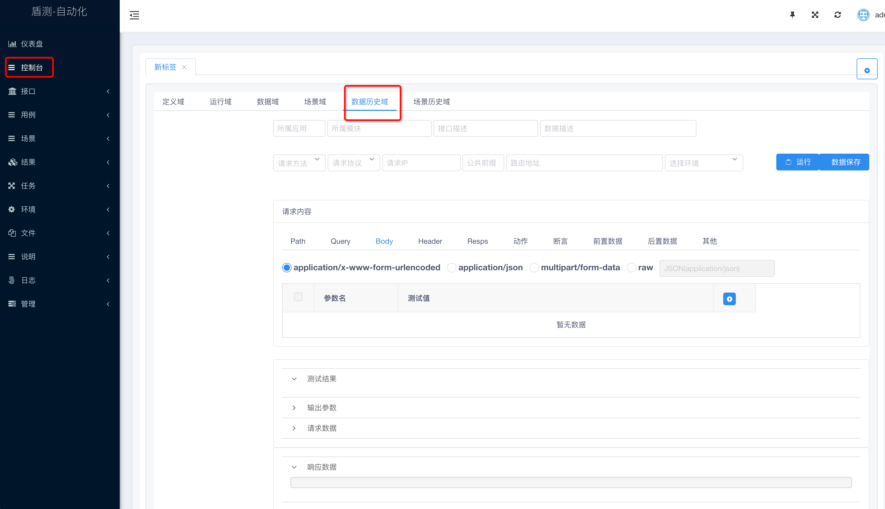
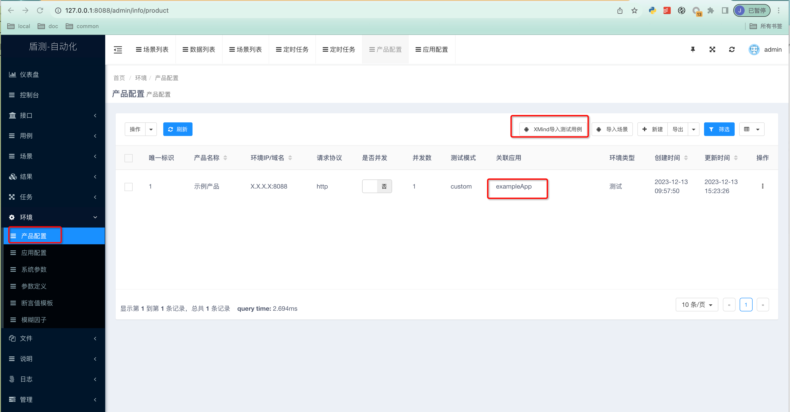
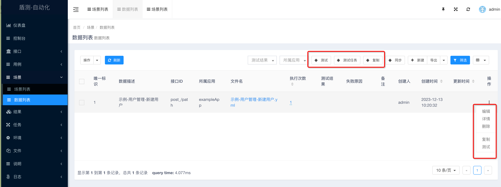
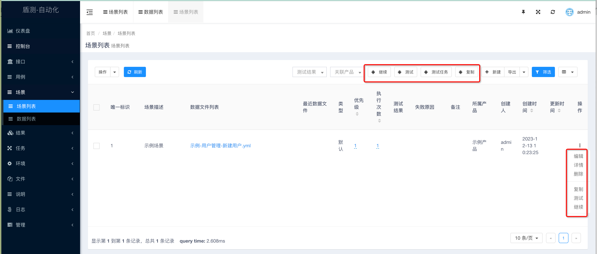
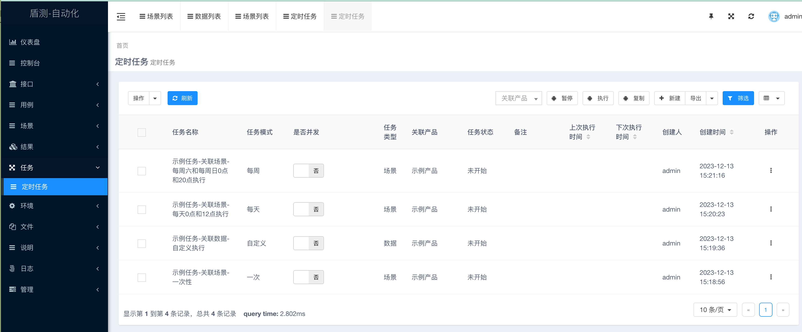

# Data4Test (盾测)

### 前言
Data4Test(盾测) 可以帮助你快速实现管理接口的自动化测试

### 功能
#### 控制台功能模块
- 定义域：接口定义管理
- 运行域：接口维度维护运行数据
- 数据域：不依赖接口定义的运行数据维护
- 场景域：各接口数据自由组合，重复使用
- 数据历史域：运行过的数据可查看历史执行情况
- 场景历史域：运行过的场景可查看历史执行情况

#### 管理域功能模块
- 仪表盘：查看系统维护的各项统计数据，e.g.: 接口类型分布， 接口规范检查，接口是否自动化，最近6个月执行分布和趋势，各应用接口统计数据等
- 控制台：可视化维护接口测试数据
- 用例：维护用例信息，以及通过Xmind导入用例的维护
- 场景：包含场景列表和数据列表，场景由1个或多个数据组成
- 结果：执行结果记录，包括：数据测试历史，场景测试历史等
- 任务：可配置一次性或定时任务执行场景或数据，关联不同环境即可实际场景，数据的复用
- 环境：鉴权信息的维护，公用参数的维护等
- 文件：数据存储分为两部分，管理数据直接存储在MySQL，执行历史数据直接存储在服务器上，减少MySQL的查询和调用，速度更快，存储更轻便。
- 说明：系统的设计和使用文档
- 日志：页面操作日志记录
- 管理：系统用户权限的维护

#### 基础特性
- HTTP接口自由组合：接口可以跨环境，跨应用自由组合成场景进行超长链路的测试
- 定义数据重复调用：同一数据文件可以被不同场景反复调用，可被同一场景反复调用
- 数据文件定义声明式：通过界面编辑测试数据后，数据保存为声明式YAML文件，支持测试数据快速批量编写
- 请求数据自动生成：通过简单的定义，系统根据定义可自动生成丰富多样的特征测试数据，减少数据的人工介入和构造
- 返回数据精准解析：通过返回数据结构定义，可进行丰富的断言和数据取用，并提供给上下游使用
- 丰富的断言类型：通过编写多样的断言定义，可对返回数据进行多方面的校验，并防呆机制
- 数据文件执行幂等：通过断言数据定义，同一数据文件在同一环境可反复执行，达到幂等
- 变量场景内无感传递：不同数据文件组合成场景，请求的变量和解析返回的变量上下文无感使用

#### 延伸特性
- 可根据请求头判断语言，自动生成对应语种的测试数据，目前支持中文，英文，可自定义其他语种的测试数据
- 支持Mock接口，返回文件的数据

### 环境要求
- linux系统/mac系统/windows系统等
- mysql5.6版本数据库

#### 依赖框架
- 数据库ORM框架：GORM v1.9.16
- Web框架：Gin v1.7.2
- 文件管理框架：Filemanager v0.0.7
- 后台数据管理框架：GoAdmin  v1.2.23
- UI组件库：Iview v2.7.4
- 控制台开发框架：Vue 2.5.2

#### 生产环境
- 下载release包
- 解压tar包：tar -xvf data4test_20XX0X0X.tgz
- 切换到文件目录：cd deploy
- 默认包提供的是linux x86版本，如有其他版本需要，请下载其他包进行替换即可
- 下载需要环境的执行文件到./deploy目录，变更包名：mv data4test_xxx data4test

##### 全新环境部署
- 创建数据库：create database data4test;
- 导入初始化数据库文件：mysql -h x.x.x.x -u user -p data4test < ./mgmt/sql/init.sql
- 更改配置文件：config.json, 所有占位符按实际情况填写,监听端口默认9088，若有冲突，可根据实际情况变更
- 部署：nohup ./data4test >/dev/null 2>&1 &
- 访问：http://10.0.X.X:9088

##### 已有环境更新
- 变更日志：./mgmt/doc/file/update/change_log.md
- 若有定时任务，在新的环境中无需执行，可以把运行中的任务暂停，运行中的任务重新部署后会自动拉起
- 导入最新变动的SQL: mysql -h x.x.x.x -u user -p data4test < ./mgmt/sql/update.sql (拉取对应日志的SQL进行更新)
- kill已有进程：ps aux | grep -i data4test | head -n 1 | awk '{print $2}' | xargs kill -9
- 重新部署：nohup ./data4test >/dev/null 2>&1 &
- 访问：http://10.0.X.X:9088  默认用户：admin/ admin

#### 开发环境：
##### 导入MySQL
- ./mgmt/sql/init.sql

##### 更新配置文件
- config.json 各项信息根据实际情况填写

##### 开启服务
- 命令：go run main.go
- 访问：http://localhost:9088  默认用户：admin/ admin

#### 目录说明
- ./mgmt/api: 放置swagger api文件，如果是单独的接口文档，与应用名称保持一致，e.g：exampleApp.json
- ./mgmt/case: 放置测试用例文件，project_V1.0.0_testcase_demo.xmind, 文件名前缀与产品名称保持一致，e.g: 示例产品_V1.0.0_测试用例.xmind
- ./mgmt/common: 放置公用文件，e.g: 模板使用说明.yml
- ./mgmt/data: 为数据用例保存的目录
- ./mgmt/upload: 为数据用例需要上传的文件目录
- ./mgmt/doc: 系统设计的详情说明以及使用说明
- ./mgmt/log: 目录下的文件自动生成，为系统启动的日志信息
- ./mgmt/old: 目录下的文件自动生成，为数据用例变更升级保留的历史版本信息
- ./mgmt/history: 目录下的文件自动生成，为数据用例执行的历史记录
- ./mgmt/download: 数据用例测试下载的文件的保存目录 (to do)

#### 社区微信群
欢迎扫码加邀请入我们的开源社区微信群，进行详细的沟通交流：  
  
(申请的时候备注填写“data4test”字样。)

#### 使用示例

