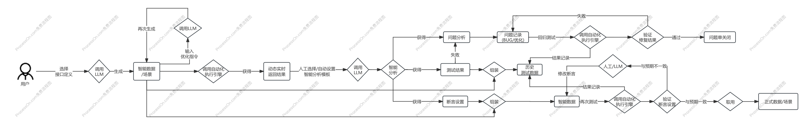

### 1.0 生成和使用流程

### 1.1 列表使用操作
- 由"智能数据"、"智能场景"等列表进行"智能分析"，如果分析结果为失败，则会自动生成对应的问题单，包含：BUG、优化
- 确认状态：可人工判断设置为"误判"
- 对修复完成的问题单，点击"回归测试", 即可进行测试，通过则问题单"回归测试结果"设置为"成功"，否则为"失败"， 默认为"未知"

### 1.2 列表字段说明
1、表头字段：问题名称记录，问题级别，问题来源，请求数据，返回数据，问题详情，确认状态，问题原因推测、回归范围建议，回归执行状态，备注，操作  
2、确认状态：BUG，优化，误判，默认为BUG状态，人工操作可变更为其他状态  
3、问题来源：场景 / 数据  
4、来源名称：场景名称 / 数据名称  
5、解决状态：创建，解决中，修复完成，验证完成，默认为创建状态  
6、问题原因推测：定位主责模块，修复建议推荐  
7、回归影响建议：回归范围建议提供  
8、影响范围：关联受影响的场景或数据  
若执行后有BUG, 则该问题记录的"回归执行状态"自动设置为"有BUG", 若功能正常，则自动设置为"功能正常"  
9、影响执行状态：有BUG, 功能正常  
10、操作：删除，批量删除，影响执行，回归执行  
11、AI生成：手动录入的问题，可手动AI生成回归范围建议，获取回归范围数据或场景，如果无相关的数据或场景，自动生成关关联  
12、回归执行：可自动关联历史数据再来一次，可自动生成新数据重新验证  
13、回归结果：失败，成功  