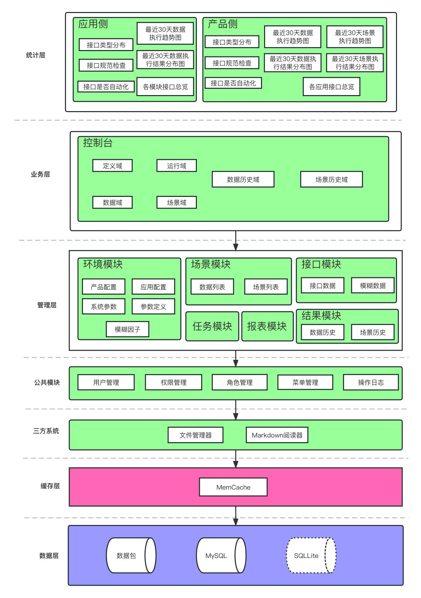

#### 依赖框架
- 数据库ORM框架：GORM v1.9.16
- Web框架：Gin v1.7.2
- 文件管理框架：Filemanager v0.0.7
- 后台数据管理框架：GoAdmin  v1.2.23
- UI组件库：Iview v2.7.4
- 控制台开发框架：Vue 2.5.2
- 控制台前端：在goman的前端框架上进行二次开发

#### 架构图

#### 全局使用流程使用

#### 数据流程图

#### 系统数据关系图
