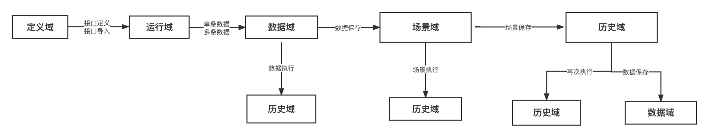

#### Dependency Frameworks
- Database ORM Framework: GORM v1.9.16
- Web Framework: Gin v1.7.2
- File Management Framework: Filemanager v0.0.7
- Backend Data Management Framework: GoAdmin v1.2.23
- UI Component Library: Iview v2.7.4
- Console Development Framework: Vue 2.5.2
- Console Frontend: Secondary development based on the frontend framework of goman

#### Architecture Diagram

#### Global Usage Flow

#### Data Flow Diagram

#### System Data Relationship Diagram

